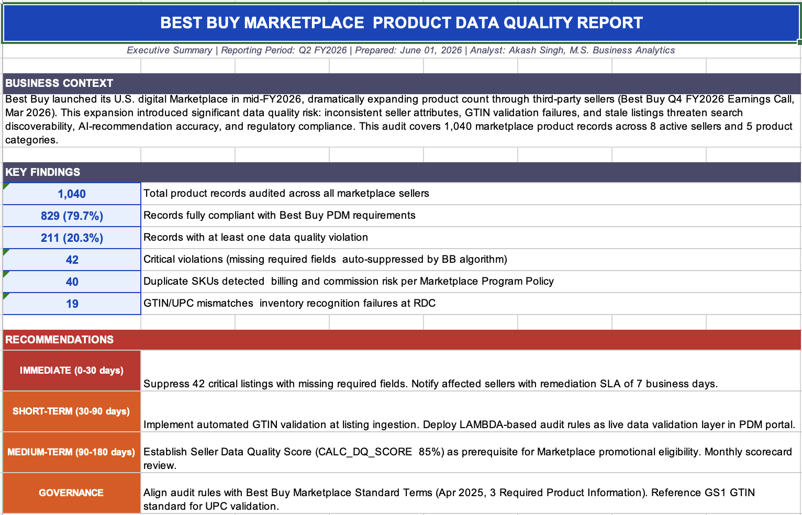
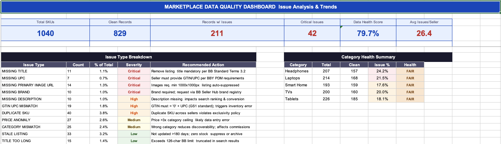
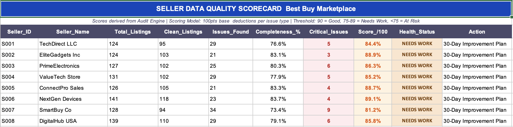

# Best Buy Marketplace Product Data Quality Audit

[](https://microsoft.com/excel)
[]()
[]()
[]()
[]()
[]()

## The Business Problem

When Best Buy launched its U.S. digital Marketplace in mid-FY2026, it dramatically expanded its product catalog by letting third-party sellers list their own inventory on BestBuy.com. The company confirmed this in its Q4 FY2026 earnings call (March 2026), noting it had "drastically increased our available product count for customers." What came with that growth was a data quality problem that every marketplace operator eventually hits at scale.

Sarah Thonet, Senior Manager of EPM Support at Best Buy, put it plainly:

> "With our recent expansion into Marketplace, the volume of product data has grown significantly. Ensuring accuracy, consistency, and usability across a much larger and more diverse data set requires strong governance, thoughtful processes, and close cross-functional collaboration."

The retail data quality platform market hit $1.62 billion in 2024 and is growing at 17.8% annually (Growth Market Reports, Aug 2025), mostly because this problem is universal. Missing a UPC means the product sits unrecognized at a distribution center for days. A wrong category means the wrong commission rate gets applied. A stale listing with zero stock gets surfaced by AI recommendation engines to customers who then cannot buy it. These are not theoretical problems — they show up in Best Buy's own PDM portal documentation as real supply chain failure modes.

This project builds the audit system that catches all of that automatically.

## What I Built

A six-sheet Excel workbook functioning as an end-to-end data quality management pipeline for a 1,040-SKU marketplace product catalog, modeled directly on Best Buy's actual attribute requirements from their Marketplace Standard Terms (April 2025), PDM portal documentation, and the ChannelEngine Best Buy US marketplace guide (November 2025).

The catalog covers five product categories across eight sellers with 21 attributes per record. Seven types of real-world data quality issues were injected into the dataset:

| Issue | Count | Why It Matters |
|---|---|---|
| Missing required field (UPC, Title, Image, Brand) | 52 | Auto-suppressed by BB algorithm; violates Standard Terms §3 |
| Duplicate SKU across sellers | 40 | Billing and commission disputes under Program Policy |
| Stale listing, zero stock, 180+ days | 33 | AI recommendation engines surface these to customers |
| Price anomaly (3x+ category ceiling) | 27 | Data entry error; triggers PDM price validation flag |
| Category mismatch | 25 | Wrong commission rate applied; reduces search visibility |
| GTIN/UPC mismatch | 19 | Inventory recognition failure at RDC per GS1 standard |
| Title exceeds 126-character limit | 15 | Truncated in search results per ChannelEngine spec |

## Workbook Overview

**Executive Summary** opens first and gives a leadership audience the business context, six live KPI numbers pulled from the audit engine, and a prioritized remediation roadmap across immediate, short-term, medium-term, and governance actions.



**Raw Catalog** holds all 1,040 source records as a professional data table with AutoFilter on all 21 columns and color-coded rows by issue type. Red rows are critical missing-field violations, amber are high-severity issues, yellow are stale listings — all applied by conditional formatting, no manual tagging needed.

**Audit Engine** runs seven formula-based validation checks per record, counts total failures, and maps that count to a four-tier severity label (CLEAN, MINOR, MODERATE, CRITICAL) with a recommended action. Uses COUNTIF with wildcards, DATEVALUE for staleness detection against TODAY(), LEN for character limit enforcement, and cross-sheet references back to the Raw Catalog.

**Seller Scorecard** calculates a weighted quality score per seller using MAX(0, 100 minus issues/total times 60 minus critical/total times 40). Sellers below 75 are flagged for suspension.



**Issue Dashboard** gives an analyst-facing summary with six KPI cards, an issue type breakdown table with severity and recommended action per issue, and a category health summary.



**LAMBDA Functions** documents eight custom named functions registered in Excel's Name Manager — covering the scoring model, GTIN validation, staleness check, title audit, price flagging, severity labeling, action mapping, and safe division. Step-by-step registration instructions included for Excel 365 and 2021+.

## Key Results

1,040 records audited. 829 fully compliant (79.7%). 211 with at least one violation. 52 critical missing-field records flagged for immediate suppression. 10,400 live formulas, zero errors.

## How to Use It

Open `BB_Marketplace_DQ_Audit.xlsx` starting on the Executive Summary tab. Register the LAMBDA functions via the instructions on the last sheet. In the Audit Engine, filter the Severity column to CRITICAL or MODERATE for immediate triage. In the Seller Scorecard, sort the Score column ascending to find at-risk sellers. Paste new catalog rows into the Raw Catalog sheet and all formulas refresh automatically.

## Repository Structure

```
best-buy-marketplace-dq-audit/
├── data/
│   └── marketplace_product_catalog.csv
├── outputs/
│   ├── executive_summary.png
│   ├── seller_scorecard.png
│   └── issue_dashboard.png
├── BB_Marketplace_DQ_Audit.xlsx
└── README.md
```

## References

Best Buy Co., Inc. Form 10-K FY2025 (SEC EDGAR, March 2025). Best Buy Q4 FY2026 Earnings Call (March 2026). Best Buy Marketplace Standard Terms, April 2025 v001. Best Buy Marketplace Program Policies, April 2025 v001. ChannelEngine Best Buy US Marketplace Guide, November 2025. GS1 US GTIN Standard. Retail Data Quality Platform Market Report, Growth Market Reports, August 2025. Atlan: Data Quality in Retail 2025.

## About

**Akash Singh** | M.S. Business Analytics, Iowa State University (May 2025)
[LinkedIn](https://www.linkedin.com/in/akash-bhupesh-singh/) | [GitHub](https://github.com/aksingh-ops)

Dataset is synthetic, generated for analytical demonstration. All Best Buy citations are from publicly available filings and documentation.
